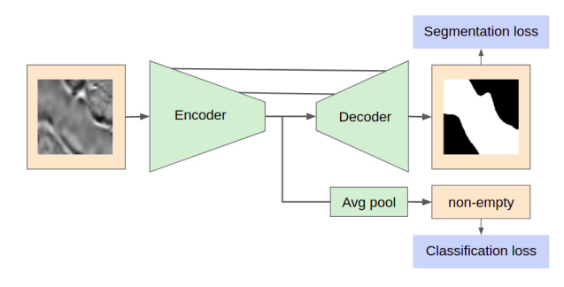
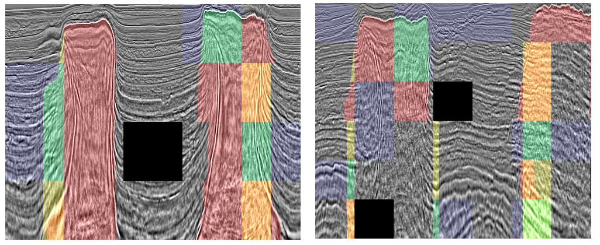

# Argus solution TGS Salt Identification Challenge

Source code of the 14th place solution by Argus team ([Ruslan Baikulov](https://www.kaggle.com/romul0212), [Nikolay Falaleev](https://www.kaggle.com/nikolasent)).


## Solution 

We used PyTorch 0.4.1 with framework [Argus](https://github.com/lRomul/argus) simplifies the experiments with [different architectures](https://github.com/lRomul/argus-tgs-salt-dev/blob/master/src/argus_models.py) and allows to focus on deep learning trials rather than coding neural networks training and testing scripts.

### Data preprocessing

The original images with size 101x101 px padded to 148x148 px with biharmonic inpaint from `skimage` package. This “padding” performed better for us than reflection or zero padding.
Random crop to the input size 128x128 px, flip in the left-right direction and random linear color augmentation (for brightness and contrast adjustment) were applied.

### Model design:



After a series of experiments, we ended with a U-Net like architecture with an SE-ResNeXt50 encoder. Standard decoder blocks enriched with custom-built FPN-style layers. In addition to the segmentation task, an additional classification branch (empty/contains salt tile) added into basic network architecture.


### Models Training

Loss: Lovasz hinge loss with [elu + 1](https://github.com/lRomul/argus-tgs-salt-dev/blob/e337c9874d3dc5a3274c5426451b314b9d837a46/src/lovasz.py#L110)     
Optimizer: SGD with LR 0.01, momentum 0.9, weight_decay 0.0001  
Train stages: 
1. EarlyStopping with patience 100; ReduceLROnPlateau with patience=30, factor=0.64, min_lr=1e-8; Lovasz * 0.75 + BCE empty * 0.25.
2. Cosine annealing learning rate 300 epochs, 50 per cycle; Lovasz * 0.5 + BCE empty * 0.5.

### Post-processing

Averaged results of two training used in the final submission:
SE-ResNeXt50 on 5 random folds.
SE-ResNeXt50 on 6 mosaic based folds (similar mosaics tiles placed in the same fold) without the second training stage.

Mosaics-based post-processing. We used the Vicens Gaitan’s [Kernel](https://www.kaggle.com/vicensgaitan/salt-jigsaw-puzzle) but not on a raw input dataset, but on images after histogram matching to an average histogram, which helps us to assembly more tiles into mosaics. In addition to extrapolating tiles with vertical masks from train subset on neighbouring tiles, we performed an automatic detection of small missed corners and inpaint them by a polygon with a smooth-curve boundary. Holes in masks were also filled with OpenCV.


### Results

 

Example of the whole mosaic post-processing. Green/blue - salt/empty regions from the train dataset; red - predicted mask; yellow - inpainted by the post-processing (used in the final submission).

The results are based on a step-by-step improvement of the pipeline, postprocessing, and fair cross-validation. Finally, results were achieved by carefully selected architectures without heavy ensembles of neural nets and second order models. Reasonable cross-validation with the evaluation metric prevented us from overfitting on the public leaderboard.

For more details on data pre- and post-processing, as well as conducted experiments with neural nets, check out a blog [post](https://nikolasent.github.io/deeplearning/competitions/2018/10/24/Semantic-Segmentation-of-Seismic-Reflection-Images.html).


## Quick setup and start 

### Requirements 

*  Nvidia drivers, CUDA >= 9, cuDNN >= 7
*  [Docker](https://www.docker.com/), [nvidia-docker](https://github.com/NVIDIA/nvidia-docker) 

The provided dockerfile is supplied to build image with cuda support and cudnn.


### Preparations 

* Clone the repo, build docker image. 
    ```bash
    git clone https://github.com/lRomul/argus-tgs-salt.git
    cd argus-tgs-salt/docker 
    ./build.sh
    ```

* Download and extract [dataset](https://www.kaggle.com/c/tgs-salt-identification-challenge/data)
    * extract train images and masks into `data/train/`
    * extract test images into `data/test/`

* The folder structure should be:
    ```
    argus-tgs-salt
    ├── data
    │   ├── mosaic
    │   ├── test
    │   └── train
    ├── docker
    ├── mosaic
    ├── notebooks
    ├── pipeline
    ├── src
    └── unused
    ```

### Run

* Run docker container 
```bash
cd docker
./run.sh
./run_pipeline.sh
```
* Start full pipeline with postprocessing 
```bash
./run_pipeline.sh
```

The final submission file will be at:
```
data/predictions/mean-005-0.4/submission.csv
```
